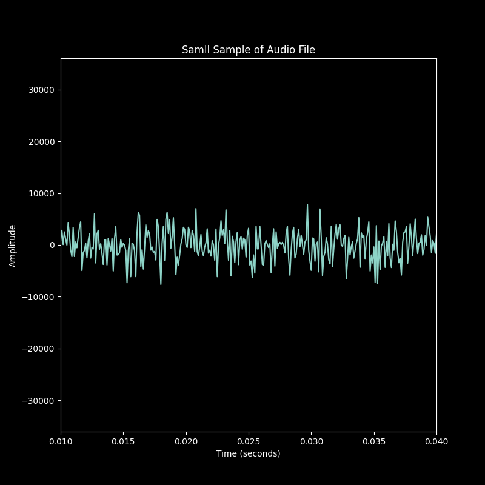
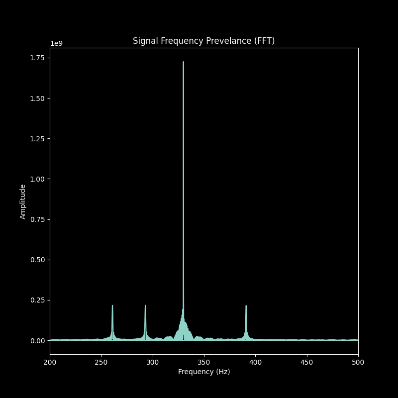
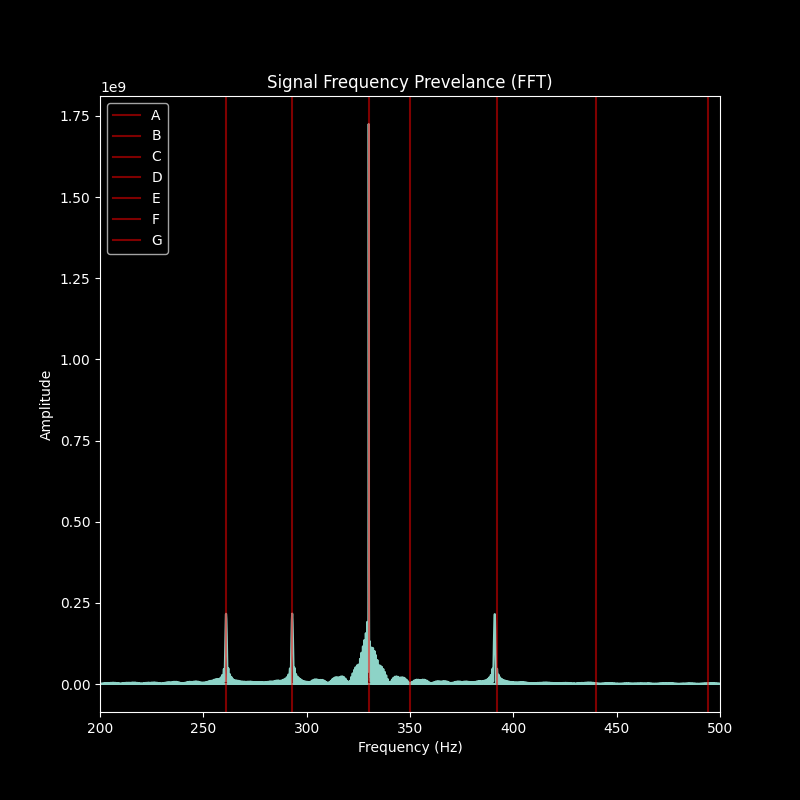
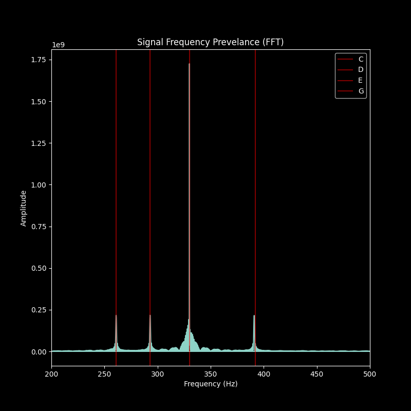

# Signal Processing and Wavelet Analysis: Part One

- Background
- Fourier Transform - Frequency, not Time
- Wavelet Transform - Frequency and Time

## Motivation and Background

Time-series data refers to when data is collected over time, making the order of the data collection and not just the value important. Time-series data can include anything from atmospheric data over a year where the maximum and minimum values corresponds to specific days in a year. 

[Graph Temperature over a Year, nino3]

For the purpose of an example, imagine a short piece of music. Each note in the piece can be any note from A to F. Each note varies based on frequency to produce different pitches and notes. Frequency measures the amount of cycles over a single second. A higher frequency is associated with a higher pitch, like an A note, while a lower frequency is associated with a lower pitch, like a C notes.

| Note   | Freq   |
|--------|--------|
| A note | 440 hz |
| B note | 494 hz |
| C note | 261 hz |
| D note | 293 hz |
| E note | 330 hz |
| F note | 350 hz |
| G note | 392 hz |

However, just graphing that a B and a D note appear in the piece does not encapulsate all the information. What is the order? BDDB is very different from DDDDBD. This is the importance of time and order in data that is lost in first passes of signal processing with tools like Fourier Transform.

### Advantages (and Disadvantages) of Fourier Transform

The first step of processing new data includes developing a basic understanding of the kinds of frequencies that are present. Are there prevailing patterns? Is one frequency more dominant? How much of the dominant frequencies overcome background noise?

Fourier Transform is a tool that can be used to pull out frequencies from raw data. For a musical example, a Fourier Transform will return the frequencies of all the notes that are present. Jingle Bells is a simple muiscal piece that is taught to beginners and children since it can be entirely played with one hand: 

"Jingle Bells, Jingle Bells, Jingle All the Way" as EEE EEE EGCDE

  

A Fourier Transform of the first lyrics would return the frequency of the notes with no information about their order.

  

It is clear that this piece of music has only a few notes, predominantly made up of the E note 

  

The Fourier Transform of a song will display the frequency of each note and the amplitude indirectly will demonstrate how prevalent a note is. However, for data that depends on time (like when a note appears in a song), this is only half the story.

  

Fourier Transform returns frequency data, known as the frequency domain, contains a great deal of important information. Depending on the resolution of the raw data, Fourier Transform will return precision information about the frequencies present in the data. This precision comes at the cost of any information about the order that the frequencies appear. While Fourier Transform can be used to determine all the frequencies in the signal, it cannot determine the time when those frequencies are present.

There will always be a compromise between the precision of the time domain and the frequency domain. Knowing more precise information about the exact frequnecy of a signal means that less information can be known about the time and order of the data and the reverse is true. Fourier Transform prioritizes precision of the frequency domain at the cost of information about the time and order.

Fourier Transform remains one of the most popular and common methods to analysis signal information. It can provide a large swath of data and compared to other Fourier Transforms in different time frames can be used to compare how a frequency changes over time.

[Example of Frequency of Temperatures in Summer vs. Winter]

#### Porque los dos? Heisenberg's Uncertainty Principle!

Heisenberg's Uncertainty Principle states that it is impossible to know the exact frequency and the exact time that a signal occurs. Any tool for signal processing will always be a compromise between a high resolution in time at the cost of low precision in frequency or a high precision in frequency with a low resolution in time.

One potential solution to Fourier Transform's lack of time information is to cut the data into smaller and smaller windows where individual Fourier Transform's can be used. Theortiically, by doing this, the Fourier Transform will return the frequencies present, but with a small enough window, it can spoof the precision of when the frequency occurs by narrowing the possible range into the window. This is known as a Short Time Fourier Transform (sometimes referred to as Windowed Fourier Transform). However, this just leads to the next problem: what range should the window be? And what about a signal that needs a longer period to become apparent. A small window is more suspsectible to frequencies being lost in the background noise. A small enough window to be precise with time would often be too small of a window to get a high precision in frequency (the strength of Fourier Transforms to begin with).

## A Solution for Both Time and Frequency: Wavelets

Wavelets transform are one potential solution to overcome and return an analysis of both time and frequency. A wavelet is a small wave of limited duration that has value of zero. There are dozens of types of wavelets, that each can be used to match different kinds of data. Some wavelets are more sensitive to sound and audio signals (like music or voices) while other are useful to find disrupances or edges (commonly used in visual data like identify the edge of an object in an image).

[Examples of Continuious Wavelets]

Wavelets work by squishing and stretching a known wave (known as a Mother Wavelet) to match a range of possible frequencies over the length of a signal. The modified squished/stretched wavelet (known as a Daughter Wavelet) will be shifted along the entire signal to compare the known wavelet frequency with the signal. Because this occurs over a known time range with a known wavelet frequency, wavelet analysis can return data both about the frequency of the signal and the time in which it occurs.

[wiki_cwt](https://upload.wikimedia.org/wikipedia/commons/9/95/Continuous_wavelet_transform.gif)
(Wikipedia: Continuous Wavelet Transform)

Because a daughter wavelet will rarely exactly match the frequency of the signal, some resolution in frequency is lost when using wavelets. No tool should be used in isolation. Using Wavelet analysis does not prevent running the same raw signal through a Fourier Transform. Instead, it can be thought as a step in the process of signal analysis. Starting with Fourier Transform, the low of resolution in Wavelet transform can be overcome.

Instead of just returning the frequency of notes present in a piece of music, wavelet transform will return the frequency of the notes and the order in which they appear over time. But what about the Unvertainty Principle? It is not possible to known both the precise time and frequency domain of a raw signal. However, wavelets overcome this by returning both with a reduced precision in the resolution of frequency. Wavelets and wavelet transforms can be used to track both the frequency and the time in which a frequency is present. Wavelets are a time-frequency representation, and are capable of providing both information about the frequency of a signal as well as the time it appeared.

  

This is ideal for analysis time-series data. Returning to the music example, a wavelet transform would return not only the frequencies of a note (with less precision and a large possible range) but also the time step in the piece when it appeared.

  

  

The larger possible range in frrequency values (along the y-axis) represent the lose in frequency resolution, however, the wavelet preserves the order that the frequency occurs (the time step along the x-axis)

[Frequency Lines]

## Wavelet Analysis Review

Fourier Transform is a useful tool in signal analysis. It can be used to determine, with a great deal of precision and accuracy, the frequencies present in a signal. However, Fourier Transform struggle to return information about when those frequencies occur. This makes them less useful when analysising signals that depend on time, like atmosmpheric data through a year, a musical piece, a patient's brain waves or a stock market.

Wavelet Transform can return both a time and frequency for signal analysis. Wavelet analysis works by squishing and stretching wavelet to match a possible frequency in a signal at a known interval of time. Wavelet analysis can return both frequency and time, at the cost of some resolution in frequency.

Much of the difficultiy in learning wavelets is due to the difficult language that is employed, making it largely inaccessible to non-mathematicians. We will review this terminiology and work through an example in part two.

## More Readings:

["A Really Friendly Guide to Wavelets" (1999)](https://www.cs.unm.edu/~williams/cs530/arfgtw.pdf)

## References

[Note Frequency Chart, Oct 4](https://nickfever.com/music/note-frequencies)
