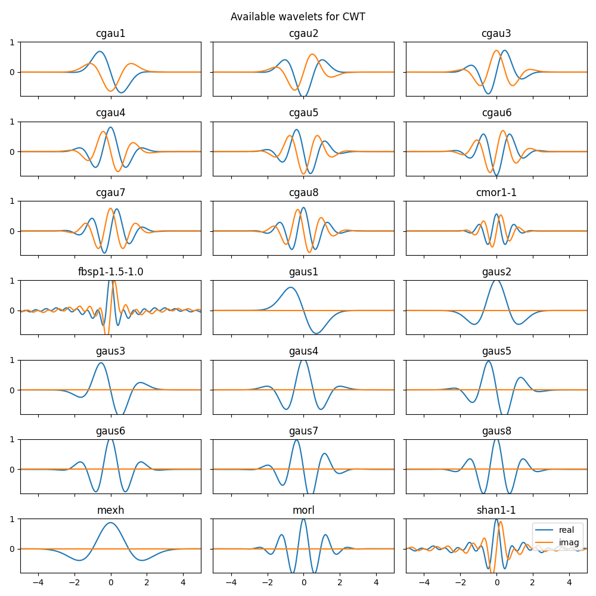
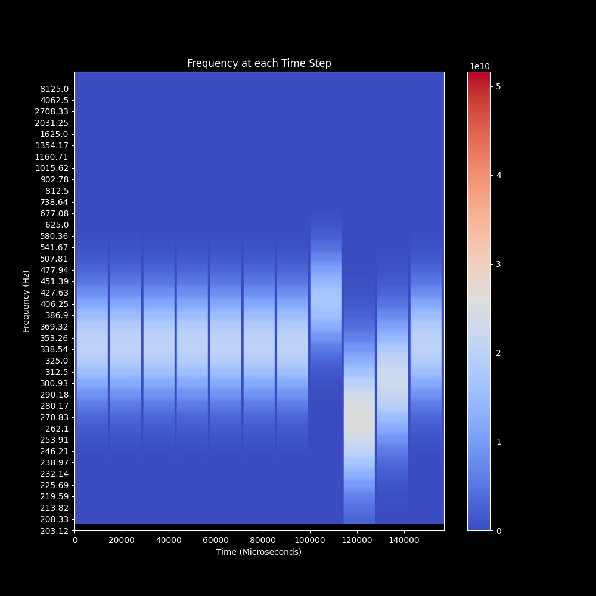
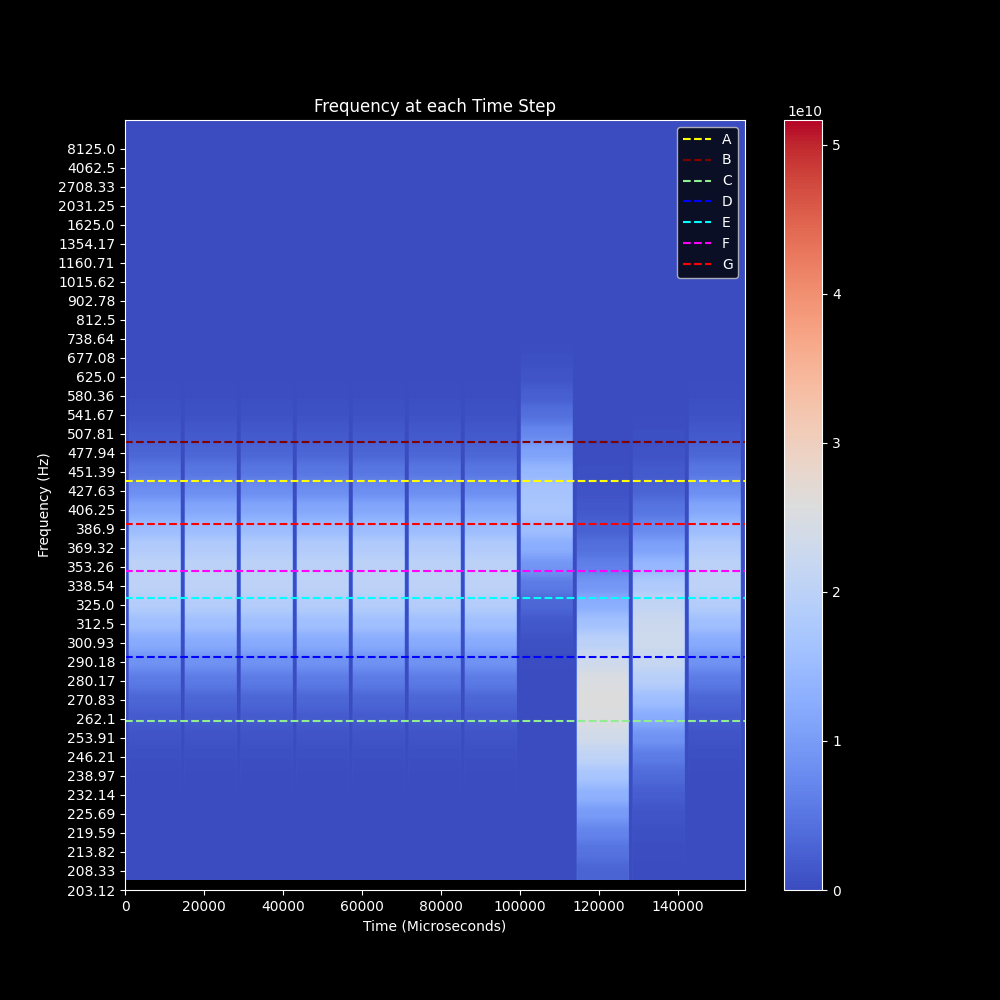
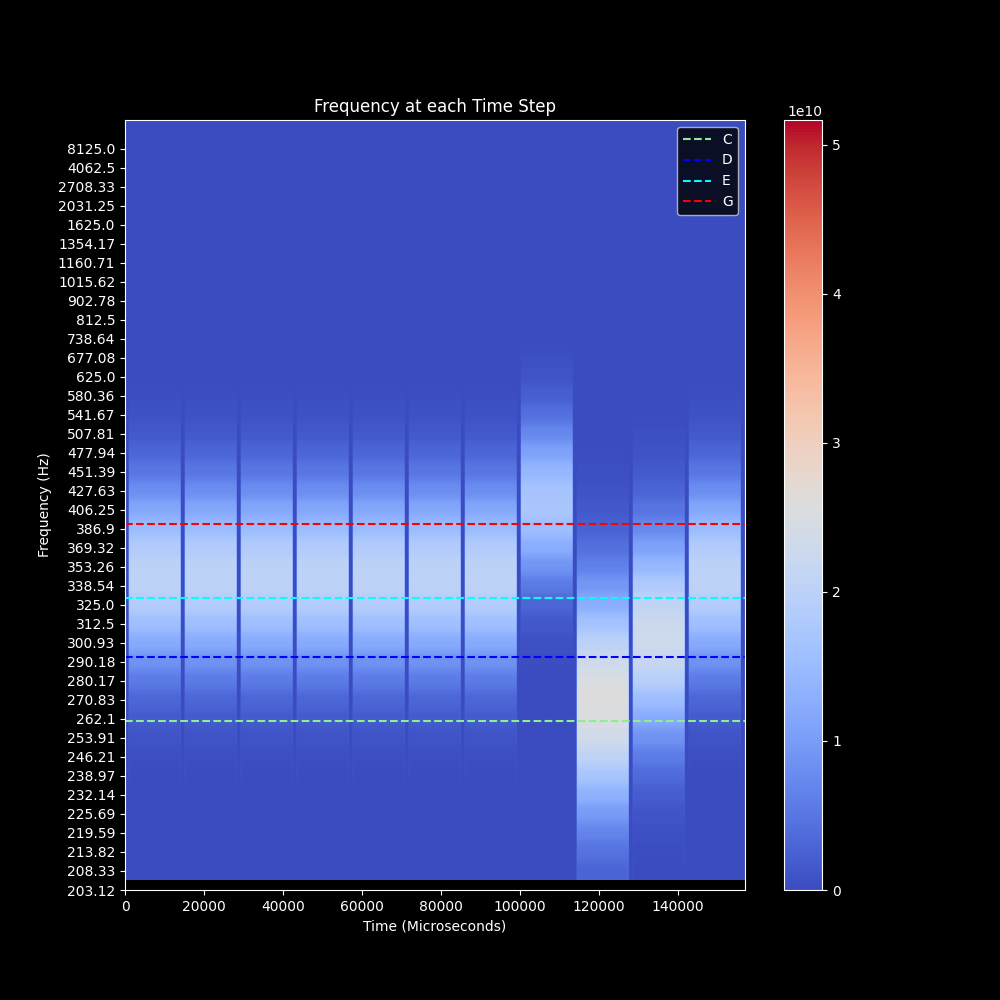

# Signal Processing and Wavelet Analysis: Part Two

- Wavelet Terminology
- Wavelet Example: Jingle Bells

## Wavelet Terminology

### Mother Wavelet

Wavelets are a powerful tool for signal and time-series data. While Fourier Transforms are a common method of signal analysis, they only return the information about the frequency of the signal and not when the frequencies occur or their duration. Due to Heisenberg's Uncertainty Principle, it is impossible to know both the exact frequency and the exact time that the frequency occurs in a signal. Wavelet transform provide a solution for returning both the frequency and time by reducing the precision of the frequency. 

While a Fourier Transform uses various sine waves to match possible frequencies in a signal, a wavelet is a short wave of with various shapes to match possible frequencies and frequency ranges. A wavelet is a small wave over a finite length of time. There are many possible wavelet forms to use. Each type of wavelet is sensitive to a range of possible signals.

<p align="center">
  
</p>

If a wavelet is made to match the the frequency of an A note for the duration of a second, then it would be possible to match any A notes present in the musical notes that last at least one second.

### Daughter Wavelet 

A mother wavelet represents the basic wavelet shape that is transformed into varied scaled copies known as daughter wavelets. The daughter wavelets are shifted along the entire signal to match possible frequencies over a finite period of time.

### Scales

Wavelet matches various frequencies by stretching and shrinking the mother wavelet based on a range of possible scales.

- Streched Wavelet: A large wavelet will capture large features, low frequencies, slow changing frequencies
- Shrunk Wavelet: A small wavelet will capture small features and high frequencies, sudden changing frequencies

### Sampling Period

The sampling period (matching the sample rate in audio) is hertz when measuring in seconds.

## Wavelet Inputs

- x: Input time-series data (for example: musical note frequency over time)
- wavelet: name of the mother wavelet
- dt: sampling period/rate (time between each y-value)
- s0: smallest scale
- dj: spacing between each scale
- jtot: largest scale

### Scales vs. Frequency

The range of scales are a combination of s0, dj, and jtot
```
import numpy as np
np.arange(s0, jtot, dj)
```

Scales from 1 to 40 represent a frequency (Hz) range from 8125 - 208.33 Hz

| Scale   | Freq (Hz) |
|--------|--------|
| 1 | 8125.00 |
| 2 | 4062.50 |
| 3 | 2708.33 |
| 4 | 2031.25 |
| 5 | 1625.00 |
| 6 | 1354.17 |
| 7 | 1160.71 |
| 8 | 1015.62 |
| 9 | 902.78 |
| 10 | 812.50 |
| 11 | 738.64 |
| 12 | 677.08 |
| 13 | 625.00 |
| 14 | 580.36 |
| 15 | 541.67 |
| 16 | 507.81 |
| 17 | 477.94 |
| 18 | 451.39 |
| 19 | 427.63 |
| 20 | 406.25 |
| 21 | 386.90 |
| 22 | 369.32 |
| 23 | 353.26 |
| 24 | 338.54 |
| 25 | 325.00 |
| 26 | 312.50 |
| 27 | 300.93 |
| 28 | 290.18 |
| 29 | 280.17 |
| 30 | 270.83 |
| 31 | 262.10 |
| 32 | 253.91 |
| 33 | 246.21 |
| 34 | 238.97 |
| 35 | 232.14 |
| 36 | 225.69 |
| 37 | 219.59 |
| 38 | 213.82 |
| 39 | 208.33 |

However, the musical range of frequenceis range from 261 - 494 Hz

| Note   | Freq   |
|--------|--------|
| A note | 440 hz |
| B note | 494 hz |
| C note | 261 hz |
| D note | 293 hz |
| E note | 330 hz |
| F note | 350 hz |
| G note | 392 hz |

## Wavelets Example in Python using PyWavelets

### [PyWavelets: pywt.cwt](https://pywavelets.readthedocs.io/en/latest/ref/cwt.html#pywt.cwt)

Wavelet analysis is accomplished in Python via external package. PyWavelets is an open source Python package for applying wavelet analysis. 

```
coeffs, freqs = pywt.cwt(data, scales, wavelet, sampling_period)
```

#### Input Values
- data: inpt data as a array_like
- scales: array_like collection of the scales to use (np.arange(s0, jtot, dj))
- wavelet: name of Mother wavelet
- sampling_period: optional sampling period for frequencies output

#### Return Value
- coefs: array_like collection of complex number output for wavelet coefficients
- freqs: array_like collection of frequencies


#### Convert Scale to Frequency
Convert a scale value to a more recognizable frequency musical range (in hertz)
```
pywt.scale2frequency(wavelet_mother, scale)*sample_rate
```
## PyWavelets
Possible musical note and frequency in hertz

| Note   | Freq   |
|--------|--------|
| A note | 440 hz |
| B note | 494 hz |
| C note | 261 hz |
| D note | 293 hz |
| E note | 330 hz |
| F note | 350 hz |
| G note | 392 hz |

```
sample_rate, signal_data = wavfile.read('jingle_bells.wav')
scales = np.arange(1, 41)
wavelet_coeffs, freqs = pywt.cwt(signal_data, scales, wavelet = "morl")
```

## Power Spectrum

`wavelet_coeffs` is a complex number with a real and an imaginary number (1 + 2i). The power spectrum plots the real component of the complex number. The real component represents the magntiude of the wavelet coefficient displayed as the absolute value of the coefficients squared

```
plt.style.use('dark_background')
fig, ax = plt.subplots(figsize=(10, 10))

wavelet_mother = "morl" # morlet

# scale determinse how squished or stretched a wavelet is
scales = np.arange(1, 41)
wavelet_coeffs, freqs = pywt.cwt(signal_data, scales, wavelet = wavelet_mother)

# Plot scalogram
# compare the power spectrum (absolute value squared)
power = np.power((abs(wavelet_coeffs)), 2)
plt.imshow(power, vmax=(power).max(), vmin=(power).min(), cmap="coolwarm", aspect="auto")

# Convert Scales to Frequency
y_tickrange = [round(pywt.scale2frequency(wavelet_mother, scale)*sample_rate,2) for scale in scales]
plt.yticks(scales, y_tickrange)

plt.title("Frequency at each Time Step")
plt.xlabel("Time (Microseconds)")
plt.ylabel("Frequency (Hz)")
plt.colorbar()
plt.savefig("p2_jingle_bells_wavelet.png")
plt.show()
```
<p align="center">
  
</p>

Overlaid with note frequencies
```
sample_rate, signal_data = wavfile.read('jingle_bells.wav')
fig, ax = plt.subplots(figsize=(10, 10))

# note frequency in hz
rate = 1/sample_rate
a_note = pywt.frequency2scale(wavelet_mother, a_freq*rate)
plt.axhline(y=a_note, color='yellow', linestyle='--', label='A')
b_note = pywt.frequency2scale(wavelet_mother, b_freq*rate)
plt.axhline(y=b_note, color="maroon", linestyle='--', label='B')
c_note = pywt.frequency2scale(wavelet_mother, c_freq*rate)
plt.axhline(y=c_note, color='lightgreen', linestyle='--', label='C')
d_note = pywt.frequency2scale(wavelet_mother, d_freq*rate)
plt.axhline(y=d_note, color='blue', linestyle='--', label='D')
e_note = pywt.frequency2scale(wavelet_mother, e_freq*rate)
plt.axhline(y=e_note, color='cyan', linestyle='--', label='E')
f_note = pywt.frequency2scale(wavelet_mother, f_freq*rate)
plt.axhline(y=f_note, color='fuchsia', linestyle='--', label='F')
g_note = pywt.frequency2scale(wavelet_mother, g_freq*rate)
plt.axhline(y=g_note, color='red', linestyle='--', label='G')

wavelet_mother = "morl" # morlet

# scale determines how squished or stretched a wavelet is
scales = np.arange(1, 41)
wavelet_coeffs, freqs = pywt.cwt(signal_data, scales, wavelet = wavelet_mother)

# Plot scalogram
# compare the power spectrum (absolute value squared)
power = np.power((abs(wavelet_coeffs)), 2)
plt.imshow(power, vmax=(power).max(), vmin=(power).min(), cmap="coolwarm", aspect="auto")

# Convert Scales to Frequency
y_tickrange = [round(pywt.scale2frequency(wavelet_mother, scale)*sample_rate,2) for scale in scales]
plt.yticks(scales, y_tickrange)

plt.title("Frequency at each Time Step")
plt.xlabel("Time (Microseconds)")
plt.ylabel("Frequency (Hz)")
plt.colorbar()
plt.legend()
plt.savefig("p2_jingle_bells_wavelet_freq1.png")
plt.show()
```
<p align="center">
  
</p>

Notes that appear to match the center range of the frequencies best
```
sample_rate, signal_data = wavfile.read('jingle_bells.wav')
fig, ax = plt.subplots(figsize=(10, 10))

# note frequency in hz
rate = 1/sample_rate
c_note = pywt.frequency2scale(wavelet_mother, c_freq*rate)
plt.axhline(y=c_note, color='lightgreen', linestyle='--', label='C')
d_note = pywt.frequency2scale(wavelet_mother, d_freq*rate)
plt.axhline(y=d_note, color='blue', linestyle='--', label='D')
e_note = pywt.frequency2scale(wavelet_mother, e_freq*rate)
plt.axhline(y=e_note, color='cyan', linestyle='--', label='E')
f_note = pywt.frequency2scale(wavelet_mother, f_freq*rate)
plt.axhline(y=g_note, color='red', linestyle='--', label='G')

wavelet_mother = "morl" # morlet

# scale determines how squished or stretched a wavelet is
scales = np.arange(1, 41)
wavelet_coeffs, freqs = pywt.cwt(signal_data, scales, wavelet = wavelet_mother)

# Plot scalogram
# compare the power spectrum (absolute value squared)
power = np.power((abs(wavelet_coeffs)), 2)
plt.imshow(power, vmax=(power).max(), vmin=(power).min(), cmap="coolwarm", aspect="auto")

# Convert Scales to Frequency
y_tickrange = [round(pywt.scale2frequency(wavelet_mother, scale)*sample_rate,2) for scale in scales]
plt.yticks(scales, y_tickrange)

plt.title("Frequency at each Time Step")
plt.xlabel("Time (Microseconds)")
plt.ylabel("Frequency (Hz)")
plt.colorbar()
plt.legend()
plt.savefig("p2_jingle_bells_wavelet_freq2.png")
plt.show()
```

<p align="center">
  
</p>

## More Readings:

["A Really Friendly Guide to Wavelets" (1999)](https://www.cs.unm.edu/~williams/cs530/arfgtw.pdf)